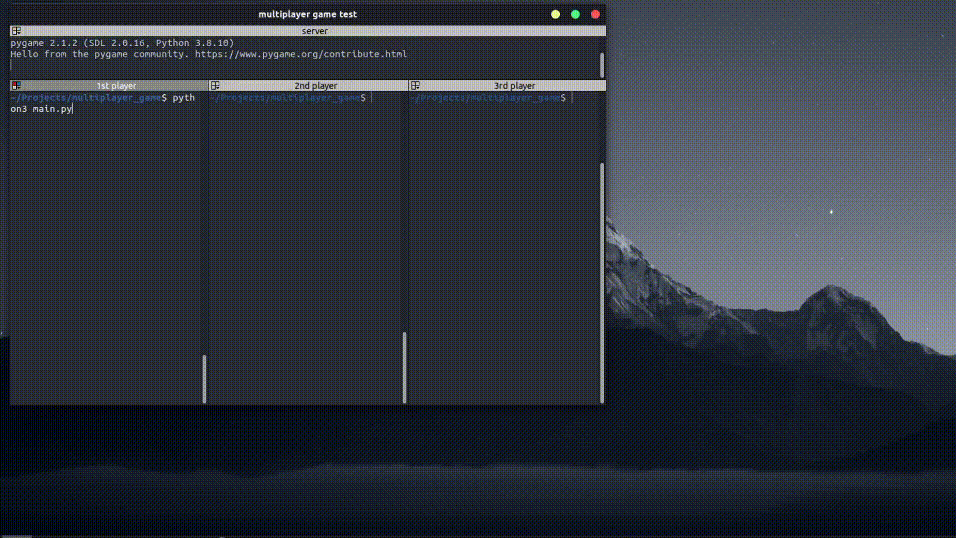

# multiplayer_game

Simple many multiplayer game written in python with socket programming and pygame. two_player_game is a prototype for the multiplayer version and works in mostly the same way except that only two players may play at a time.

server.py is a merging and modification of socket_utils/multiclient.py and socket_utils/client.py also in my respositories.

# Demo

